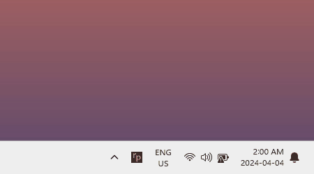
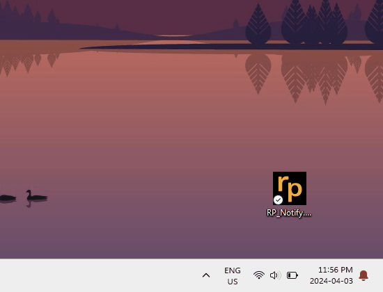
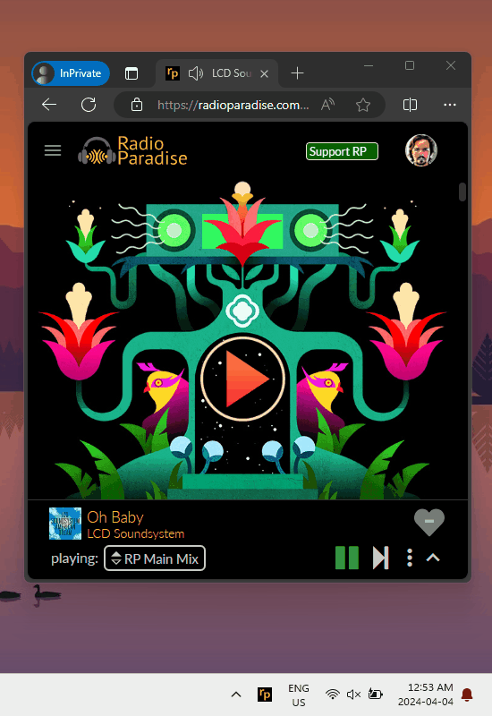
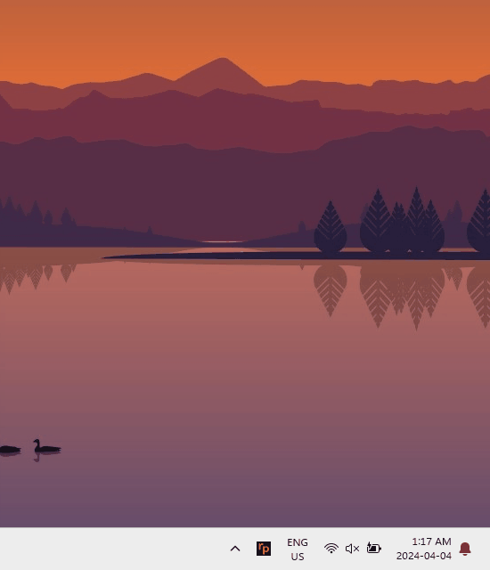
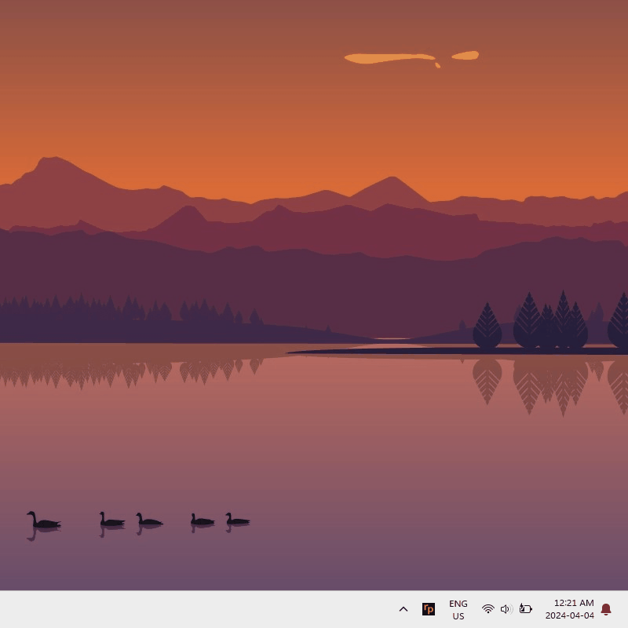
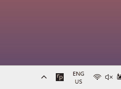
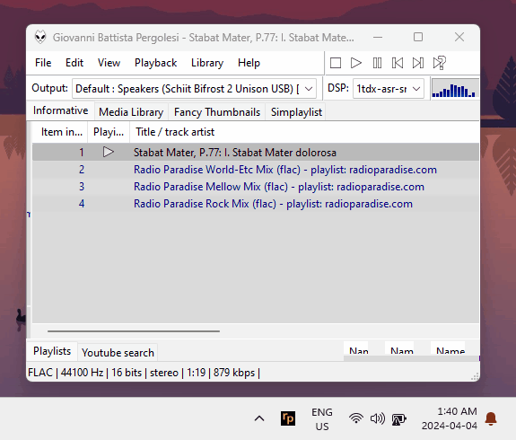
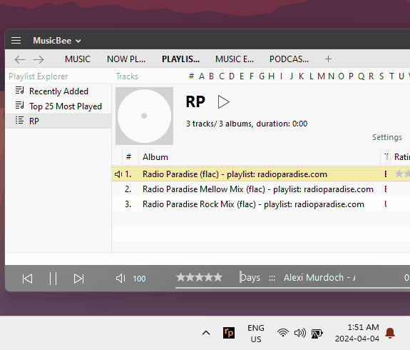
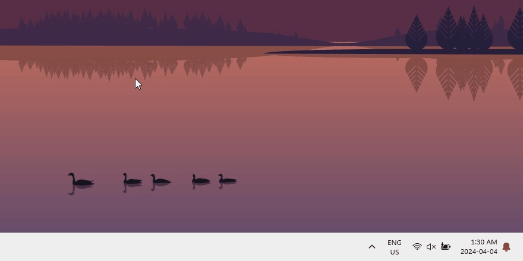
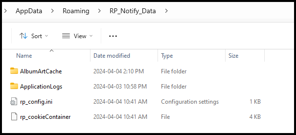

# Radio Paradise song info desktop notification

Optimized for Windows 11

[Download the RP_Notify app](https://github.com/gvajda/radio-paradise-song-notification/releases/latest/download/RP_Notify.exe)

## Summary

My goal was to receive non-intrusive but detailed updates on the currently played songs in [Radio Paradise](https://radioparadise.com/) and the option to send song ratings without the need to interrupt what I was doing and open the website or search for browser tabs.

> **Disclaimer**
> This is not an official Radio Paradise product. The logo is owned by Radio Paradise and the source of all displayed data - including album art - is the Radio Paradise REST API.

## Getting started

The RP_Notify app doesn't need installation, just download the .exe file using the link above and save it anywhere on your computer.

On the first start, the app will prompt you to choose the location of the RP_Notify_Data folder that will contain your saved settings, logs, etc ([more on this below](#configuration)). The size of this folder will not exceed ~20MB.

The app will also display an icon in the Windows tray, all settings can be reached by right-clicking on this icon. I recommend to drag this icon in the visible section of the Windows tray for easy access:

## Features

### Radio Paradise stream tracking

- **Track official Radio Paradise players**
  - Display updates of songs played in the browser or official mobile apps (not including the cached playback)
  - The app will notice if you skip a song or switch channel
  - Only available if the user is logged in  
  *Note*: Your password is not saved or logged - [learn more](#rest-api-request-authentication)  
  *Note*: The official player tracking may be a little bit laggy because it requires polling the RP API and I tried to avoid spamming it.
- **Support for all channels**
  - Including the Favorites and 2050 channels
  - The channels list is updated on startup (channels added/removed in the future will display properly)
  - The 2050 channel is a bit tricky, the app will display updates when a song is played, but not during the conversation
- **Audio player integration**
  - Track the RP stream played in Foobar2000 or MusicBee audio players  - [see below](#audio-player-integration)

### Song rating

- **Support for rating songs**
  - Only available if the user is logged in  
  *Note*: Your password is not saved or logged - [learn more](#rest-api-request-authentication)
- **Prompt for song rating**
  - Display a toast notification with the song rating input field 20 seconds before the song ends or if the channel is changed
  - Optional - *Tip*: very useful to grow the song pool of the "My Favorites" channel
- **Trigger the song rating tile from the Windows Action Center**
  - Like all other Windows notifications, the RP_Notify notifications will remain visible in the Windows Action Center showing a history of songs you listened to. This enables one to send a rating for a song that was played in the past.
  - This will also work when the app is not open

### Notification visuals

- **Album art**
  - Configure image size in the menu
  - Optional RP banner  
  *Note*: only applies to the rich notification triggered by double-clicking on the tray icon
- **Display/hide song rating**
  - Optional - in case you prefer or not to know the crowd rating before you send in your own

- **Tooltip**
  - Activated by hovering over the tray icon
  - Quick and short song info including remaining time

## Under the hood

### Audio player integration

Radio Paradise can be played in any audio player using the [stream links](https://radioparadise.com/listen/stream-links) and the application works with some of them to enable/disable song notification when a stream is started/stopped and change channels based on which channel is played. This feature can be enabled one by one for each supported audio player. Please see the details below.

#### Foobar2000

The integration requires the *foo_beefweb* plugin for Foobar2000 that provides REST interface to the player.

[Download foobar2000 for Windows](https://www.foobar2000.org/download)

[Download foo_beefweb plugin](https://www.foobar2000.org/components/view/foo_beefweb)

#### MusicBee

The integration requires the *MusicBeeIPC* plugin for MusicBee that provides an API and SDK for several various programming languages to the player.

[Download MusicBee for Windows](https://getmusicbee.com/downloads/)

[Download MusicBeeIPC plugin](https://getmusicbee.com/forum/index.php?topic=11492.msg70007)

### Configuration

#### Config folder location options

On the first start, the app will prompt you to choose the location of the RP_Notify_Data folder that will contain your saved settings, logs, cached album art and the optional cookie file if you choose to log in and send song ratings using the app.

The folder location options are the following:

- **Next to the application (RP_Notify.exe)**
  - The default option
  - This is the 'portable' mode - until the *RP_Notify.exe* file and the *RP_Notify_Data* folder are in the same place, it will find it and look for the settings inside
  - This option enables to use the app from a USB stick on a different computer or have multiple copies of the app with different settings and user logins
- **C:\users\YOURNAME\\.AppData\Roaming\RP_Notify_Data**
  - With this option, you can move the *RP_Notify.exe* file around, it will always start with the saved settings
- **Don't keep anything (clean up on exit)**
  - When you are not sure if you want the app to save anything just yet
  - The folder will be created because the app is implemented in a way to persist the settings when it changes, but it will be deleted when the app exits

**Note**: the folder location can be changed after the initial choice from the app settings

#### Config folder contents

- **rp_config.ini**
  - All settings set in the system tray menu are saved here
  - Editing this file manually (or programmatically) has the same effect as changing the setting via the menu
- **rp_cookiecache**
  - The identical cookie that is stored by your browser upon logging into the official site
  - Used to authenticate RP API requests so the app will be able to send song ratings and query what is played by the user in the browser or the official apps
  - **`The cookies do NOT store user passwords`**
- **AlbumArtCache**
  - Folder to temporarily save the albumart files displayed on the notifications so they are not downloaded every time a new notification is displayed
  - Limited to 20 files (~10MB)
- **ApplicationLogs**
  - Log files containing application events and arguments
  - Can be attached when a bug is reported
  - Limited to 10 files and 1MB per file

#### REST API request authentication

If available, the RP REST API requests are authenticated using the HTTP cookie sthat is saved after the user provides login info.

> [!NOTE]  
> The app retains only the identical cookie that is stored by your browser upon logging into the official site. **The RP_Notify app does NOT save or log your password**. You have the option to delete the cookie by logging out or erase all stored app data (including the cookie) through the menu in the system tray.

## About the project

This is a hobby project to obtain deeper knowledge of C# and practice

- design patterns
- dependency injection
- sync/async
- pub-sub
- REST calls
- Windows Toast notifications
- logging and error handling
