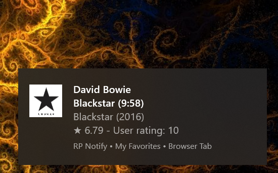

# Radio Paradise song info desktop notification
For Windows 10

[Download](https://github.com/gvajda/radio-paradise-song-notification/releases/latest/download/RP_Notify.exe)

## Summary

A tray-only application to track the songs played on [Radio Paradise](https://radioparadise.com/) via Desktop notification.
The goal was to get non-intrusive but detailed updates of what's currently playing and the option of rating the songs without the need to interrupt what I'm doing and open the website.

**Note:** the notifications are synchronized with live streams, not with the browser-based advanced player.

**Disclaimer:** This is not an official Radio Paradise product. The logo is owned by Radio Paradise and the source of all displayed data - including album art - is the Radio Paradise REST API.

## Features:

- **Support for all channels** - the channels list is updated on startup
- **Show album art**
- **Show song rating**
- **Support for rating songs** - this needs the user to provide login data. No authentication data is stored or logged, only the cookie that a browser would store
- **Track stream played in Foobar2000 player** - see below

### Technical
 - The application will write data in folder:
 *c:\Users\<username>\AppData\Roaming\RP_Notify*
    - The *config.ini* file in the folder referred above is synchronized with memory so besides of storing configuration it can act as an API to change settings
    - In case the user logs in the cached cookie file will be kept in the same folder
    - Logging can be enabled only by editing the *config.ini* file. Logs will be kept in the same folder
- When the application is running, the shortcut of the app will apperar in the Start menu (this is required for the Desktop notifications). This shortcut will be left in Start menu or deleted upon eciting the app depending on the settings in the tray menu.

 Note: The app wasn't tested with insufficient user rights.

### Foobar2000 integration

If this feature is enabled in the menu and an RP stream is played with the F2K player then the desktop notification is adjusted to the played stream and displaying the desktop notification turns on/off with the playback. Requires a plugin for Foobar2000 that provides REST interface to the player.

[Download foobar2000 for Windows](https://www.foobar2000.org/download)

[Download foo_beefweb plugin](https://www.foobar2000.org/components/view/foo_beefweb)

## Screenshots

**Simple notification when a song starts**

**Detailed notification - when double-click on tray icon**

**Tray menu**

## About the project
This is hobby a project to obtain deeper knowledge in C# and practice 
- depedency injection
- sync/async
- pub-sub
- REST calls
- Windows Toast notifications
- logging and error handling

### To-do
- Improve login panel (Toast notifications don't support masking input text boxes for passwords)
- Add "About" panel and user guide in app
- Clean up Toast notification XML generating code
- Display history and upcoming songs
