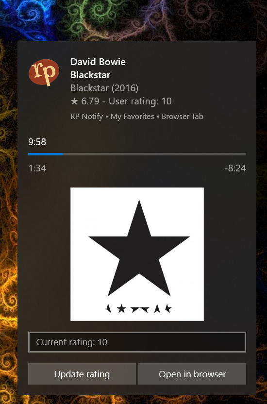

# Radio Paradise song info desktop notification

For Windows 10

[Download](https://github.com/gvajda/radio-paradise-song-notification/releases/latest/download/RP_Notify.exe)

## Summary

A tray-only application to track the songs played on [Radio Paradise](https://radioparadise.com/) via Desktop notification.
The goal was to get non-intrusive but detailed updates of what's currently playing and the option of rating the songs without the need to interrupt what I'm doing and open the website or search for browser tabs.

**Disclaimer:** This is not an official Radio Paradise product. The logo is owned by Radio Paradise and the source of all displayed data - including album art - is the Radio Paradise REST API.

## Features

- **Support for all channels** - the channels list is updated on startup (channels added/removed in the future will display properly)
- **Show album art** - configure size in menu
- **Show song rating** - optional
- **Support for rating songs** - this needs the user to provide login data. No authentication data is stored or logged, only the cookie that a browser would store
- **Track stream played in Foobar2000 player** - [see below](#foobar2000-integration)
- **Track official Radio Paradise players (*New*)** - display updates of songs played in the browser or mobile apps, including the "My Favorites" channel 
*Note*: this feature works without logging in if the player/browser is on the same network (has the same IP)
- **Prompt for song rating (*New*)** - display a toast notification with the song rating input field 20 seconds before the song ends or if the channel is changed. Optional and only available if the user is logged in 
*Tip*: very useful to grow the song pool of the "My Favorites" channel

### Technical

- The application will write data in folder:
 *c:\Users\<username>\AppData\Roaming\RP_Notify*
    - The values in the *config.ini* file in the folder referred above is synchronized with the in-memory config so besides of storing configuration it can act as an API to change settings
    - In case the user provides logs in data, the generated cookie file will be kept in the same folder
    - Logging can be enabled only by editing the *config.ini* file. Log files will be kept in the same folder
- When the application is running, the shortcut of the app will apperar in the Start menu (this is required for the Desktop notifications). This shortcut will be left in Start menu or deleted upon exiting the app depending on the settings in the tray menu.

### Audio player integration

Radio Paradise can be played in any audio player using the [stream links](https://radioparadise.com/listen/stream-links) and the application works with some of them to enable/disable song notification when a stream is started/stopped and change channels based on which channel is played. This feature can be enabled one-by-one for each supported audio player. Please see the details below.

#### Foobar2000

The integration requires the *foo_beefweb* plugin for Foobar2000 that provides REST interface to the player.

[Download foobar2000 for Windows](https://www.foobar2000.org/download)

[Download foo_beefweb plugin](https://www.foobar2000.org/components/view/foo_beefweb)

#### MusicBee

The integration requires the *MusicBeeIPC* plugin for MusicBee that provides an API and SDK for several various programming languages to the player.

[Download MusicBee for Windows](https://getmusicbee.com/downloads/)

[Download MusicBeeIPC plugin](https://getmusicbee.com/forum/index.php?topic=11492.msg70007)

## Screenshots

### Simple notification when a song starts

### Detailed notification - when double-click on tray icon

### Tray menu

## About the project

This is hobby a project to obtain deeper knowledge in C# and practice 

- depedency injection
- sync/async
- pub-sub
- REST calls
- Windows Toast notifications
- logging and error handling

### To-do

- Improve login panel (Toast notifications don't support masking input text boxes for passwords)
- Display history and upcoming songs
